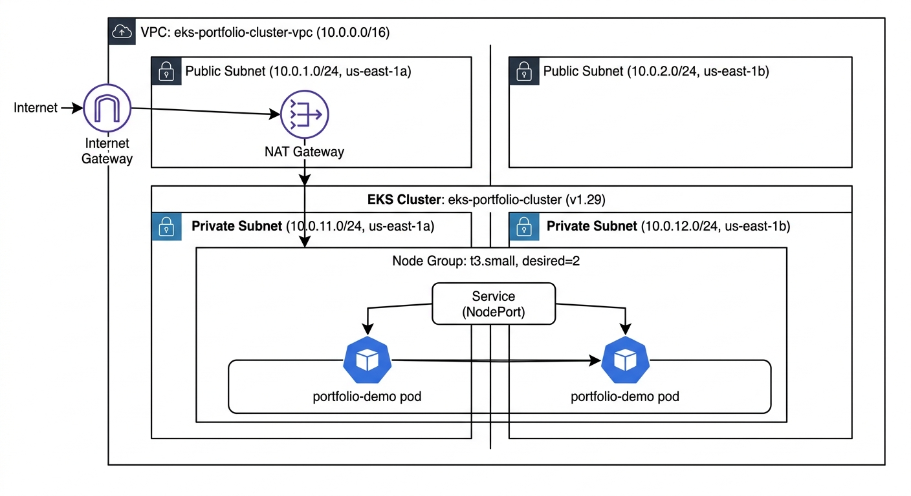

# Production-Style EKS Cluster on AWS with Terraform


## The Problem

A team needs a Kubernetes cluster that can be torn down and rebuilt identically across environments — not a snowflake cluster someone clicked together once and is now afraid to touch. This project provisions that cluster entirely from code, deploys a real application onto it, and validates every layer locally before any real AWS spend.

## Architecture



**Traffic flow:** Internet → Internet Gateway → Public Subnet → NAT Gateway → Private Subnet → EKS Node Group → Service (NodePort) → Pods

## What This Demonstrates

| Capability | Detail |
|---|---|
| **Infrastructure as Code** | Full VPC (`10.0.0.0/16`) with 2 public + 2 private subnets across 2 AZs, EKS cluster, and managed node group — zero console clicks |
| **Modular Terraform** | Separate `networking` and `eks` modules; the environment wires them together via outputs |
| **Remote state** | S3 (`brian-eks-tfstate`) + DynamoDB locking (`terraform-locks`) so anyone on the team can rebuild the cluster |
| **Real workload** | nginx Deployment + NodePort Service deployed and verified with live HTTP traffic |
| **Cost-aware validation** | Every `terraform plan/apply` validated against MiniStack (local AWS emulator) before touching a billed account; workload tested on a local `kind` cluster at $0 cloud spend |

## Project Structure

```
eks-terraform-project/
├── terraform/
│   ├── environments/
│   │   └── dev/
│   │       ├── main.tf          # Wires networking + EKS modules; provider config
│   │       └── backend-setup.tf # S3 + DynamoDB remote state
│   └── modules/
│       ├── networking/          # VPC, subnets, IGW, NAT, route tables
│       │   ├── main.tf
│       │   ├── variables.tf
│       │   └── outputs.tf
│       └── eks/                 # IAM roles, EKS cluster, managed node group
│           ├── main.tf
│           ├── variables.tf
│           └── outputs.tf
├── k8s/
│   ├── deployment.yaml          # 2-replica nginx Deployment
│   └── service.yaml             # NodePort Service
└── docs/
    └── architecture.jpeg
```

## Cluster Details

| Resource | Value |
|---|---|
| Cluster name | `eks-portfolio-cluster` |
| Kubernetes version | `1.29` |
| VPC CIDR | `10.0.0.0/16` |
| Node type | `t3.small` |
| Node scaling | desired 2 / min 1 / max 3 |
| State bucket | `brian-eks-tfstate` |
| Lock table | `terraform-locks` |

## Prerequisites

- [Terraform](https://developer.hashicorp.com/terraform/install) >= 1.0
- [AWS CLI](https://docs.aws.amazon.com/cli/latest/userguide/install-cliv2.html) configured with appropriate credentials
- [kubectl](https://kubernetes.io/docs/tasks/tools/)
- [kind](https://kind.sigs.k8s.io/docs/user/quick-start/#installation) (for local workload validation)

## Deployment

**1. Stand up the infrastructure:**
```bash
cd terraform/environments/dev
terraform init
terraform plan
terraform apply
```

**2. Deploy the workload** (against a local `kind` cluster, since MiniStack emulates the EKS control plane but does not expose a live Kubernetes API to schedule against):
```bash
kind create cluster --name eks-portfolio-demo
kubectl apply -f k8s/deployment.yaml
kubectl apply -f k8s/service.yaml
```

**3. Verify it's serving traffic:**
```bash
kubectl port-forward svc/portfolio-demo-svc 8080:80
curl http://localhost:8080
```

You should see the nginx welcome page returned as raw HTML — confirmation that the Deployment, Service, and pod networking are all wired correctly.

## Key Design Decisions

**Remote state over local state** — local state breaks the moment more than one person needs to touch the infrastructure, or a laptop dies mid-apply. S3 + DynamoDB locking makes the cluster team-safe and prevents concurrent-apply corruption.

**Managed node group over self-managed EC2** — trades a small amount of control for AWS handling node patching and lifecycle, the right tradeoff for a project without dedicated platform headcount.

**Validate against a local emulator before touching real AWS** — catching a misconfigured IAM trust policy or a bad subnet reference against MiniStack costs nothing and takes seconds; catching the same error against real AWS costs time, and sometimes money.

## What I'd Change in Production

Move node provisioning to **Karpenter** instead of a static managed node group. A fixed-size group pays for capacity around the clock even when traffic is flat overnight — Karpenter provisions nodes just-in-time based on actual pending pods, which is the difference between infrastructure that works and infrastructure that works efficiently.

## Cleanup

```bash
cd terraform/environments/dev
terraform destroy

kind delete cluster --name eks-portfolio-demo
```
